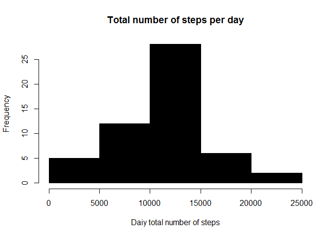
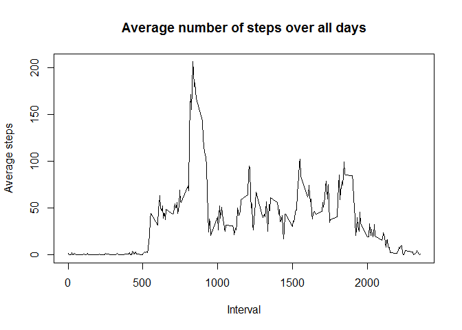
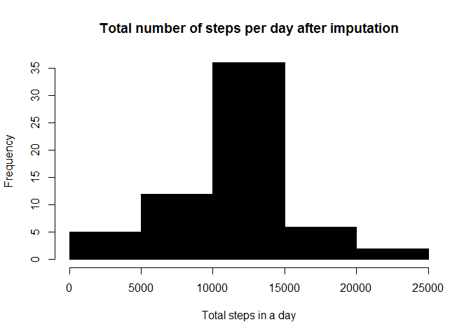
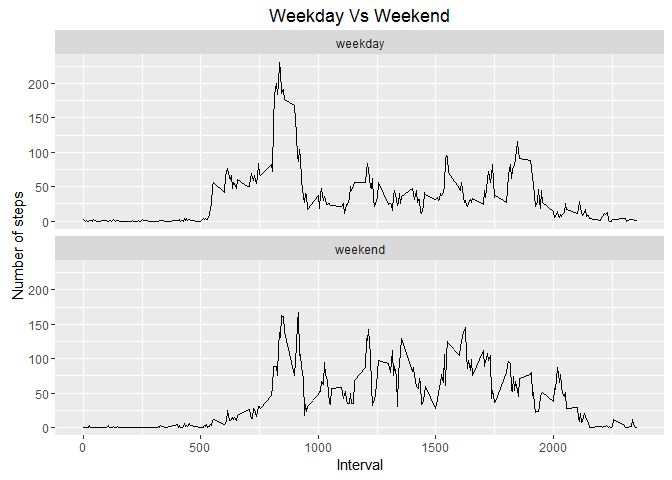

# Reproducible Research: Peer Assessment 1
library(dplyr)


## Loading and preprocessing the data

```r
activity <- read.csv("activity.csv", colClasses = c("numeric", "character", "numeric"))
activity$date <- as.Date(activity$date, "%m/%d/%Y")
```
### We generate activity2. Here we omit all rows that have NA for steps

```r
activity2 <- na.omit(activity)
```
### What is mean total number of steps taken per day?

```r
total_stepsByDate <- aggregate(steps ~ date, activity2, sum)
```
### We create histogram of total number of steps in a day

```r
hist(total_stepsByDate$steps, col=1, main="Total number of steps per day", 
     xlab="Daiy total number of steps")
```

<!-- -->

### We get mean and median total number of steps per day

```r
mean(total_stepsByDate$steps)
```

```
## [1] 10766.19
```

```r
median(total_stepsByDate$steps)
```

```
## [1] 10765
```

### What is the average daily activity pattern?
### Make a time series plot (i.e. type = "l") of the 5-minute interval (x-axis) and the average number of steps taken, averaged across all days (y-axis)

### We aggregate steps as interval to get average number of steps in an interval across all days

```r
total_stepsByInterval <- aggregate(steps ~ interval, activity2, mean)
```

## We generate the line plot of the 5-minute interval (x-axis) and the average number of 
# steps taken, averaged across all days (y-axis)

```r
plot(total_stepsByInterval$interval, total_stepsByInterval$steps, type='l', col=1, 
     main="Average number of steps over all days", xlab="Interval", 
     ylab="Average steps")
```

<!-- -->
### find row id of the maximum steps

```r
maxSteps_rowid <- which.max(total_stepsByInterval$steps)
```

### get the interval with maximum average number of steps in an interval

```r
total_stepsByInterval[maxSteps_rowid, ]
```

```
##     interval    steps
## 104      835 206.1698
```
  
### Imputing missing values
### Find the total rows of missing values

```r
sum(is.na(activity$steps))
```

```
## [1] 2304
```
### We perform the imputation for missing vlues

```r
for (i in 1:nrow(activity)){
  if (is.na(activity$steps[i])){
    interval_val <- activity$interval[i]
    row_id <- which(total_stepsByInterval$interval == interval_val)
    steps_val <- total_stepsByInterval$steps[row_id]
    activity$steps[i] <- steps_val
  }
}
```

### After imputation we aggregate steps as per date to get total number of steps in a day

```r
total_stepsByDateImputed <- aggregate(steps ~ date, activity, sum)
```

### We create histogram of total number of steps in a day

```r
hist(total_stepsByDateImputed$steps, col=1, main="Total number of steps per day after imputation", xlab="Total steps in a day")
```

<!-- -->

### We get mean and median of total number of steps per day

```r
mean(total_stepsByDateImputed$steps)
```

```
## [1] 10766.19
```

```r
median(total_stepsByDateImputed$steps)
```

```
## [1] 10766.19
```

### We get mean and median of total number of steps per day for data with NA's removed

```r
mean(total_stepsByDate$steps)
```

```
## [1] 10766.19
```

```r
median(total_stepsByDate$steps)
```

```
## [1] 10765
```

#### there is slight change in median value because of data imputation


### Are there differences in activity patterns between weekdays and weekends?
### We create 2 new columns to acivity data frame, one for indicating day of the week and another for day type

```r
activity$day <- weekdays(activity$date)
head(activity)
```

```
##       steps       date interval    day
## 1 1.7169811 2012-10-01        0 Monday
## 2 0.3396226 2012-10-01        5 Monday
## 3 0.1320755 2012-10-01       10 Monday
## 4 0.1509434 2012-10-01       15 Monday
## 5 0.0754717 2012-10-01       20 Monday
## 6 2.0943396 2012-10-01       25 Monday
```

```r
activity$day_type <- c("weekday")
head(activity)
```

```
##       steps       date interval    day day_type
## 1 1.7169811 2012-10-01        0 Monday  weekday
## 2 0.3396226 2012-10-01        5 Monday  weekday
## 3 0.1320755 2012-10-01       10 Monday  weekday
## 4 0.1509434 2012-10-01       15 Monday  weekday
## 5 0.0754717 2012-10-01       20 Monday  weekday
## 6 2.0943396 2012-10-01       25 Monday  weekday
```

### If day is Saturday or Sunday, we make day_type as weekend

```r
for (i in 1:nrow(activity)){
  if (activity$day[i] == "Saturday" || activity$day[i] == "Sunday"){
    activity$day_type[i] <- "weekend"
  }
}
```
### convert day_time from character to factor

```r
activity$day_type <- as.factor(activity$day_type)
```

### we get average number of steps in an interval across all days

```r
total_stepsByIntervalImputed <- aggregate(steps ~ interval+day_type, activity, mean)
```

### We make panel plot for weekdays and weekends

```r
library(ggplot2)

qplot(interval, steps, data=total_stepsByIntervalImputed, geom=c("line"), xlab="Interval", 
      ylab="Number of steps", main="Weekday Vs Weekend") + facet_wrap(~ day_type, ncol=1)
```

<!-- -->
